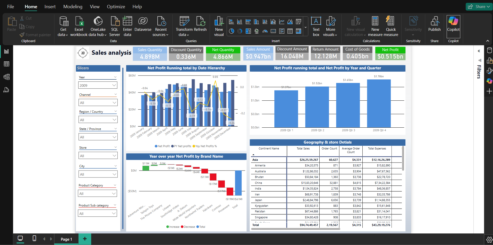

# Sales Power BI Report

This repository contains a comprehensive Power BI report designed to analyze sales performance. It provides interactive visualizations and insights to help businesses make data-driven decisions.

## Features
- Interactive dashboards for sales trends.
- Insights into product performance.
- Region-wise sales analysis.

## Installation
1. Clone the repository:
    ```bash
    git clone https://github.com/Joystondsouza0926/Power_BI_Project.git
    ```
2. Open the Power BI file using [Microsoft Power BI](https://app.powerbi.com/links/-zqMHPHfvE?ctid=5ccc8f12-35f1-4e10-b9f0-0b8abf6b75e9&pbi_source=linkShare).
   
## Usage
- Import your sales data into the Power BI file.
- Explore the interactive visualizations to uncover insights.

## Screenshots

## Contributing
Contributions are welcome! Please open an issue or submit a pull request for any improvements.

## Contact
Created by Joyston D'Souza - [LinkedIn](https://www.linkedin.com/in/joystondsouza0926/)
